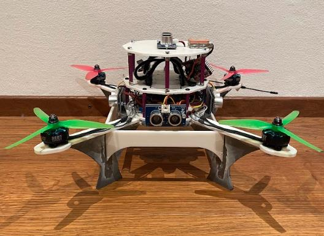
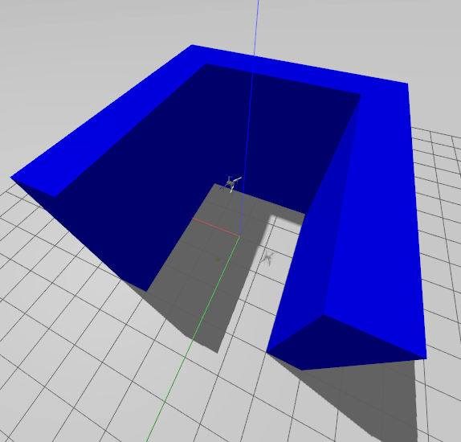

# DroneObstacleAvoidance



This repository contains the software, simulation environment and
hardware-oriented code developed for my 2023 Matura thesis at
Kantonsschule Uster:

"Autonome Wegfindung eines Quadrocopters mithilfe des FloodFill
Algorithmus"

The goal was to design, build and program a quadcopter capable of
navigating toward a target while detecting obstacles and replanning its
path around them.

The project combines autonomous navigation, robotics simulation,
flight-control software, sensor integration, embedded computing,
electronics and custom-built drone hardware.

[Read the full thesis
(German)](./Maturita%CC%88tsarbeit_Felix_Bischof.pdf)

## Project Overview

The navigation system represents the environment as a discrete 2D grid.
As distance measurements are received, detected obstacles are inserted
into the map. A stack-based Flood-Fill algorithm then calculates the
distance of each reachable cell from the target.

The drone chooses a free neighbouring cell with the smallest distance
value and converts that grid movement into a physical flight command.
Because the map and distance field are recalculated when detected
obstacles are added, the planned route can change accordingly.

The autonomous navigation algorithm and simulation pipeline were
developed and tested in Gazebo with ArduPilot SITL before the navigation
code was adapted for the physical quadcopter.

## System Architecture

The simulation and physical prototype use different paths for receiving
distance measurements.

### Simulation architecture

``` text
  Gazebo range sensors
            |
            v
      ros_gz_bridge
            |
            v
          ROS 2
            |
            v
+-----------------------+
| Autonomous Navigation |
|                       |
|  Obstacle Mapping     |
|  Flood-Fill Planner   |
|  Movement Selection   |
+-----------+-----------+
            |
            v
   DroneKit / MAVLink
            |
            v
     ArduPilot SITL
            |
            v
         Gazebo
```

### Physical prototype architecture

``` text
Ultrasonic distance sensors
            |
            v
    Raspberry Pi GPIO
            |
            v
+-----------------------+
| Autonomous Navigation |
|                       |
|  Obstacle Mapping     |
|  Flood-Fill Planner   |
|  Movement Selection   |
+-----------+-----------+
            |
            v
   RX/TX connection
            |
            v
 ArduPilot on Kakute F7
            |
            v
      ESC / motors
```

### Simulation stack

- Gazebo Garden - physics, environment and range-sensor simulation
- ROS 2 - sensor communication using nodes and topics
- ros_gz_bridge - bridges Gazebo sensor messages to ROS 2
- ArduPilot SITL - simulated autopilot and flight controller
- DroneKit and MAVLink - vehicle communication and movement commands
- Python and NumPy - mapping and path planning

The main simulation node subscribes to four directional
sensor_msgs/LaserScan topics named front, back, left and right,
processes the range data and updates the obstacle map before replanning
the route.

## Autonomous Navigation

### Grid representation

For the thesis, navigation is performed on a 9 x 9 grid. The program
maintains three maps:

- map_obstacles - detected obstacle locations
- map_distance - Flood-Fill distance from each reachable cell to the
  target
- map_movement - cells visited by the drone

Detected obstacles are marked as blocked cells and excluded from the
path planner.

### Flood-Fill path planning

Flood Fill and A\* were compared during development. For the implemented
prototype, I chose a stack-based Flood-Fill approach.

Starting from the target, the algorithm propagates outward through the
grid and assigns every reachable cell a distance value. Obstacles are
excluded from the propagation.

The drone evaluates its four neighbouring cells and moves into one with
the lowest distance to the target. If multiple cells have the same
minimum value, one is selected randomly.

### Dynamic replanning

The navigation loop is:

1.  Receive new range measurements.
2.  Insert newly detected obstacles into the map.
3.  Rebuild the distance map.
4.  Run Flood Fill from the target.
5.  Select the best neighbouring cell.
6.  Convert the grid step into a relative flight command.
7.  Repeat as new sensor data becomes available.

This allows the planned path to change as detected obstacles are added
to the map.

## Simulation and Testing



The navigation algorithm was developed iteratively in simulation. Early
tests used simple walls before moving to more complex obstacle
configurations.

The full simulation pipeline is:

``` text
Gazebo range sensors
        |
        v
   ros_gz_bridge
        |
        v
      ROS 2
        |
        v
Python navigation node
        |
        v
 DroneKit / MAVLink
        |
        v
  ArduPilot SITL
        |
        v
Gazebo quadcopter
```

Testing in simulation made it possible to observe the full autonomous
behaviour, inspect telemetry and debug navigation errors without risking
the physical aircraft.

The helper script [startupSimSITL.py](./startupSimSITL.py) starts
Gazebo, ArduCopter SITL and the ROS/Gazebo bridges used by the
directional sensors.

## Physical Quadcopter

Alongside the simulation, I designed and built the physical quadcopter
from individual components.

### Mechanical design

The frame and sensor mounts were designed in Tinkercad and manufactured
using 3D printing. The structure was designed around the flight
electronics, onboard Raspberry Pi and distance sensors rather than using
an off-the-shelf drone frame.

### Electronics and onboard computing

The Raspberry Pi 3 Model B+ serves as the onboard computer and runs the
navigation software. The six Grove ultrasonic distance sensors are
connected directly to its GPIO pins. Each sensor uses a voltage, ground
and signal connection, with the measured distance passed to the
Raspberry Pi for processing.

The Holybro Kakute F7 flight controller runs ArduPilot and receives
control commands from the Raspberry Pi through crossed TX/RX
connections. The four motors are controlled through a Hobbywing Xrotor
4-in-1 ESC. The EM-406A GPS module is connected separately using power,
ground and a data connection.

Power is split between two batteries. A 1400 mAh 6S LiPo supplies the
flight controller, ESC and motors, while a 2400 mAh 1S LiPo supplies the
Raspberry Pi through a Purecrea MT3608 step-up voltage regulator. A
TP4056 charge controller is used to protect the Raspberry Pi battery.

A hardware-oriented version of the navigation code is included in
[lidar_subscriber_realDrone.py](./ros2_ws/src/my_drone_test/my_drone_test/lidar_subscriber_realDrone.py).

## Hardware Testing and Project Status

The completed quadcopter was assembled successfully and its basic flight
functionality was verified through manual test flights.

The autonomous navigation algorithm itself was successfully tested in
the Gazebo/SITL environment. A complete autonomous flight on the
physical aircraft was not achieved within the project timeframe because
communication between the Raspberry Pi and flight controller worked only
in one direction. Additionally, GPS data could not be read successfully.

The repository therefore contains the autonomous-navigation
implementation validated in simulation, together with the
hardware-oriented code and files from the physical prototype.

## Technologies

### Software

- Python
- NumPy
- ROS 2
- Gazebo Garden
- ros_gz_bridge
- ArduPilot and ArduCopter
- ArduPilot SITL
- DroneKit
- MAVLink and Pymavlink
- Flood-Fill path planning
- Grid-based obstacle mapping
- Tinkercad

### Hardware

- Raspberry Pi 3 Model B+
- Holybro Kakute F7 flight controller
- Hobbywing Xrotor 4-in-1 ESC
- Four motors
- Six Grove ultrasonic distance sensors
- EM-406A GPS module
- 1400 mAh 6S LiPo battery
- 2400 mAh 1S LiPo battery
- Purecrea MT3608 step-up voltage regulator
- TP4056 charge controller
- 3D-printed custom frame and sensor mounts
- GPIO and crossed TX/RX connections

## Repository Structure

``` text
DroneObstacleAvoidance/
|
|-- docs/
|   |-- physical_drone.jpeg
|   `-- gazebo_u_obstacle.png
|
|-- ros2_ws/
|   `-- src/
|       `-- my_drone_test/
|           `-- my_drone_test/
|               |-- lidar_subscriber.py
|               `-- lidar_subscriber_realDrone.py
|
|-- models/                 # Gazebo / ArduPilot model files
|-- worlds/                 # Custom Gazebo test environments
|
|-- startupSimSITL.py       # Starts Gazebo, SITL and sensor bridges
|-- connectionTest.py       # Basic DroneKit / vehicle connection tests
|
|-- Maturitätsarbeit_Felix_Bischof.pdf
`-- README.md
```

The main simulation implementation is
[ros2_ws/src/my_drone_test/my_drone_test/lidar_subscriber.py](./ros2_ws/src/my_drone_test/my_drone_test/lidar_subscriber.py).

## Possible Improvements

The following improvements are the ones described in the thesis:

- Avoid applying Flood Fill to the entire map when some distance values
  are irrelevant to the current step. Alternatively, implement A\*,
  which calculates a single path from the drone to the target instead of
  calculating all possible paths as Flood Fill does, reducing the
  required resources and execution time.
- Extend the algorithm from two dimensions to three dimensions so that
  the drone can also make use of vertical movement.
- Add a web interface or application for setting the target and
  displaying the map and flight path. Information could be exchanged
  between the drone and the end device over Bluetooth or a local
  network.
- Move the static distance sensors back and forth with servos. If each
  of the four directional sensors rotated through 90 degrees, the drone
  could obtain a 360-degree view and detect multiple or larger obstacles
  in one step. This would require a second algorithm that uses the angle
  and distance of each measurement to place obstacles on the map.
- Use a 3D LiDAR sensor to measure the entire surrounding space at once.
  This could scan the environment faster, with the main challenge being
  the algorithm required to process the resulting data.

## Thesis

This project was developed as my 2023 Matura thesis at Kantonsschule
Uster.

Title: Autonome Wegfindung eines Quadrocopters mithilfe des FloodFill
Algorithmus

The thesis documents the theoretical background, algorithm selection,
implementation, simulation setup, mechanical and electrical
construction, testing process and possible future improvements.

[Read the full thesis
(German)](./Maturita%CC%88tsarbeit_Felix_Bischof.pdf)
